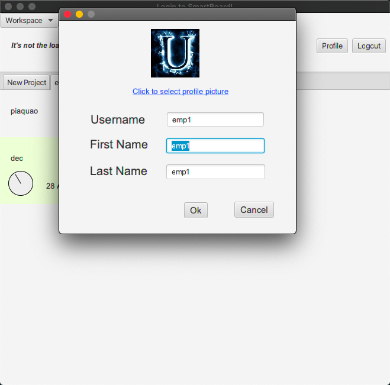

# Kanban board application using javafx
> This application acts as a **complete** kanban board system.
> Also known as a Trello board application it helps in product development and distribution of tasks among employees

## Meta
**Anuj Sharma** – [s3820112]– s3820112@student.rmit.edu.au - Further Programming COSC2391

## Overview
This program serves the main purpose of setting up tasks and a todo list for different users by allowing them to create 
a profile and maintain the tasks in their databases. Users can also set up different tasks for completely different
projects. this kanban board application can prove to be a great assistance for time management task distribution and
keeping a check on whether someone is receiving way more work load than required.

### Users
Everybody is a user and there is no one with administrative rights. If you a register as a new user You need to enter
your first name last name username and password you also have to choose a profile picture, but for choosing a picture 
you have to and enter the path where you have saved this java project and the list of images that you can choose are 
in the *img* folder in the resources package 

#### Default User Login:
`username: emp1` `password: emp1`

## Installation
In order to install this project, the `.zip` file can simply be downloaded to your personal machine.
From there, the file titled `FPAssignment2` within the `application` directory can be run from the file explorer,
on any machine that has Java installed.

## Development Setup
All dependencies for this application are present within the `application` directory of the project.

## Packaging
**The main class is main.java**

### Class Packages:
- main.java
- main.resources

### Demo Video Link
https://web.microsoftstream.com/video/cc137354-72d5-48a5-9a68-d11971799815

### Screenshots of the application
the login system

the register system

project window with tasks

another project

change the profile details after login 

changing and choosing the profile picture.
